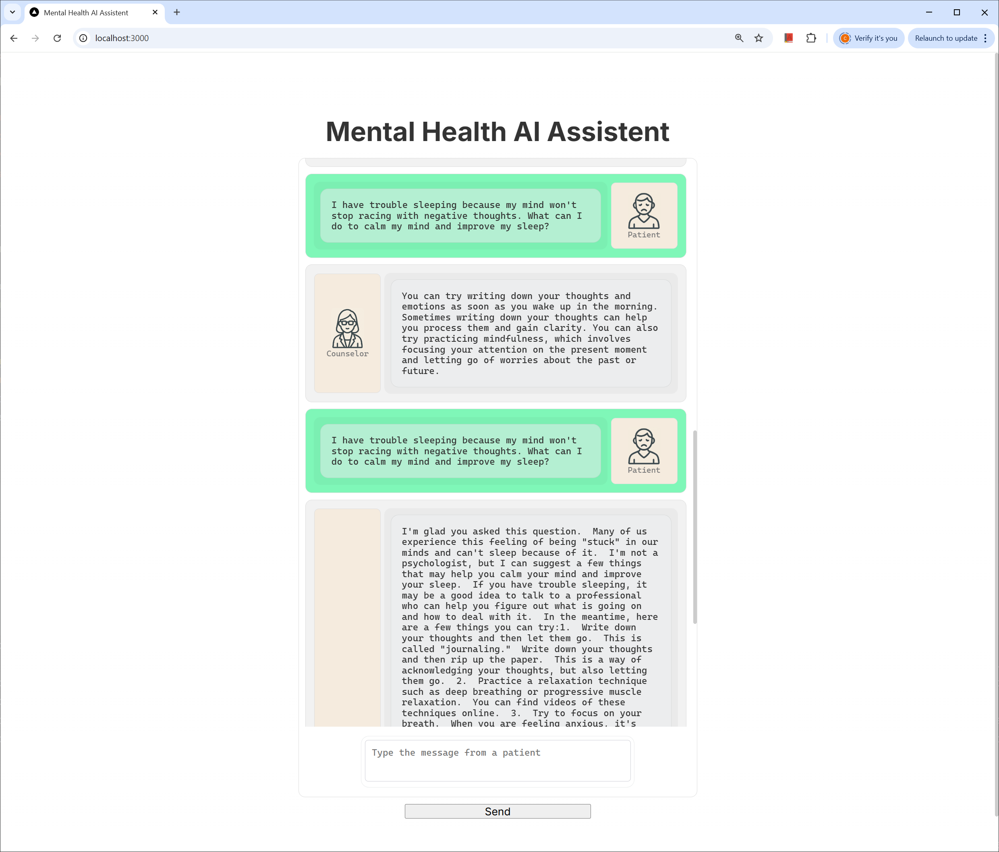
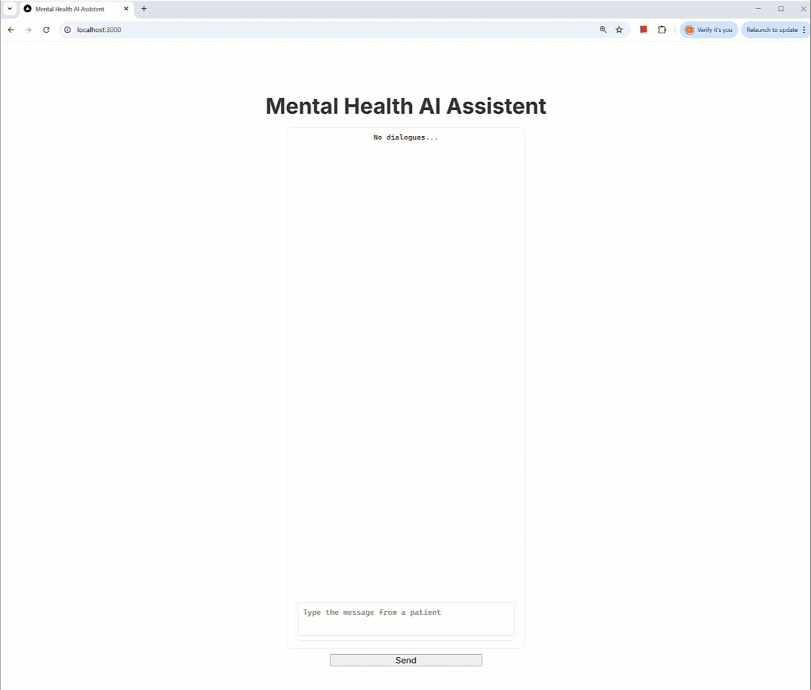

# Project Result Report
## Overview

This project aimed to develop a web-based application to assist mental health counselors by providing real-time guidance on how to best support their patients. The solution integrates a frontend, a backend server, and fine-tuned Large Language Models (LLMs) to generate contextually relevant advice.

## Project Components

The project consists of three main components:

1. **Fine-tuned LLM Models**: Two open-source LLM models, Qwen2.5-7B and Llama-3.2-3B, were fine-tuned specifically on mental health counseling transcript datasets to enhance their ability to provide accurate and contextually appropriate advice.

2. **Backend Server (FastAPI)**: A scalable and efficient backend built using FastAPI, responsible for handling requests from the frontend, managing data flow, and interfacing with the fine-tuned LLM models.

3. **Frontend Web Application**: A responsive and intuitive web interface enabling real-time chat interactions between counselors and patients. Counselors can input free-text descriptions of patient challenges and receive immediate, AI-generated guidance.

## Machine Learning Model Development
Fine-tuning a model is to assist mental health counselors in responding to patients' feelings and questions. I extracted and prepared the dataset for the model. Starting with two models can help us focus on comparing their responses and performance more effectively. Once we analyze the results, we can adjust parameters or explore additional models to improve the system's performance and accuracy. In this project, I only focus on the two models and use the same parameter sets for simplicity.

### Dataset and Analysis
A dataset consisting of mental health counseling transcripts was collected from the following link.
https://www.kaggle.com/datasets/thedevastator/nlp-mental-health-conversations/data

### Fine-Tuning Procedure
The fine-tuning of the language model was performed using the following approach.

#### 1. Model and Tokenizer Initialization
The pre-trained model and tokenizer were loaded from the Unsloth library, specifically using the `FastLanguageModel.from_pretrained` method. The model was initialized with a maximum sequence length of 2048 tokens, and quantization was applied by loading the model in 4-bit precision to optimize GPU memory usage, since I have one GeForce RTX 4090.

#### 2. Dataset Preparation
The dataset was loaded from a CSV file using Hugging Face's `datasets` library. Each data entry was formatted into a structured conversational template consisting of a system instruction, user context, and assistant response. The tokenizer's chat template was applied to format the data appropriately. 

#### 3. Parameter-Efficient Fine-Tuning (PEFT) Setup
To efficiently fine-tune the model, Parameter-Efficient Fine-Tuning (PEFT) was employed using Low-Rank Adaptation (LoRA). LoRA was configured with the following hyperparameters:
- Rank (`r`): 16
- LoRA Alpha (`lora_alpha`): 16
- LoRA Dropout: 0
- Target Modules: Attention and feed-forward projection layers (`q_proj`, `k_proj`, `v_proj`, `o_proj`, `gate_proj`, `up_proj`, `down_proj`)
- Gradient checkpointing was enabled to further optimize memory usage.

#### 4. Training Configuration  
The training was conducted using Hugging Face's `SFTTrainer` from the TRL library, with the following training arguments: 
- Gradient accumulation steps: 4
- Evaluation strategy: every 20% of total steps
- Warm-up steps: 5
- Maximum training steps: 60
- Learning rate: 2e-4
- Optimizer: 8-bit AdamW
- Weight decay: 0.01
- Learning rate scheduler: linear decay
- Precision: Automatic selection between FP16 and BF16 based on GPU support

#### 5. Saving the Fine-Tuned Model
The fine-tuned model and tokenizer were saved to disk for future use and reproducibility.

### Model Comparison
To evaluate and compare the performance of the two models—**Qwen2.5-7B** and **Llama-3.2-3B-Instruct**—I conducted a structured comparative analysis using a set of identical contexts. The evaluation process involved the following steps:

#### 1. Data Preparation  
A new test dataset with 20 cases was generated by GPT-4.5. The two fine-tuned LLM models were used to generate new responses using this test dataset. These responses were stored in separate CSV files (`response-Qwen2.5-7B.csv` and `response-Llama-3.2-3B-Instruct.csv`) and loaded into pandas DataFrames for analysis.

#### 2. Evaluation Criteria  
Each pair of responses (one from Qwen2.5-7B and one from Llama-3.2-3B-Instruct) was evaluated based on two primary criteria:
- **Accuracy**: The correctness and factual alignment of the response with the provided context.
- **Contextual Appropriateness**: The relevance, coherence, and suitability of the response given the context.

#### 3. Comparative Analysis Procedure using GPT-4.5 
For each context-response pair, I constructed a standardized evaluation prompt clearly outlining the evaluation criteria. This prompt included:
- The original context.
- The responses generated by both models (clearly labeled as "Qwen Response" and "Llama Response").
- Instructions for a comparative analysis based on the defined criteria.

I then utilized an independent evaluator (GPT-4.5 via the OpenAI API) to objectively assess and compare the responses. The evaluator was explicitly instructed to:
- Provide a brief comparative analysis for each criterion.
- Clearly identify the overall superior response (either "Qwen" or "Llama") along with a concise justification.

#### 4. Result Extraction and Aggregation  
After receiving the evaluator's comparative analysis, I programmatically extracted the evaluator's final judgment regarding the superior response using regular expressions. I maintained counters to track the number of times each model was identified as superior, as well as instances where the evaluator could not clearly determine a winner (counted as ties).

#### 5. Final Scoring and Reporting  
At the conclusion of the evaluation process, I aggregated the results to produce a final comparative score, clearly indicating:
- The total number of contexts where Qwen was superior.
- The total number of contexts where Llama was superior.
- The number of ties or undetermined cases.

### Model Selection

| Attributes               | Llama-3.2-3B | Qwen2.5-7B  |
|--------------------------|--------------|-------------|
| Fine-tuning Dataset Size | 3,512        | 3,512       |
| Fine-tuning Time         | 332 seconds  | 260 seconds |
| Scores (by GPT-4.5)      | 18/20        | 2/20        |

Llama-3.2-3B appeared to perform better according to the scores. I selected Llama-3.2-3B as the backend LLM model for the application.

#### Reason: 
Llama's response is more accurate and contextually appropriate, directly addressing the user's concerns about validating their experiences, offering practical coping strategies, and providing empathetic reassurance.

## Implementation of a Chat Interface Using a Large Language Model (LLM)
The developed web application provides an interactive chat interface designed to simulate a mental health counseling session. The frontend is built using Next.js, a React-based framework, and leverages state management through custom stores to handle chat messages and user interactions. The backend integrates a Large Language Model (LLM) to dynamically generate contextually relevant responses.

### Frontend Development
The frontend interface is structured using Next.js components. The main chat interface component (`ChatInterface`) manages user interactions and displays conversation history. State management is handled through custom stores (`useMSGStore` and `useActorsStore`), which maintain the state of messages and chat participants respectively.

Upon initialization, the application defines two actors:
- **Counselor (Bot)**: Represents the AI-driven mental health assistant.
- **Patient (User)**: Represents the user interacting with the system.
 
### Backend Integration with LLM
The backend service utilizes the selected fine-tuned LLM to generate contextually appropriate responses. The user's input is passed to the LLM, which processes the input and returns a coherent, context-aware reply. This integration allows the application to simulate realistic conversational interactions, enhancing the user's experience and providing meaningful mental health support.

### Technologies Used
- **Frontend**: Next.js, React, CSS Modules, Zustand (state management)
- **Backend**: FASTAPI endpoints, integration with the selected fine-tuned LLM
- **Communication**: Asynchronous HTTP requests via JavaScript's Fetch API

## Web UI 
The web application is designed to simulate a conversation between a patient and a counselor, providing advice and support for mental health concerns.

### Key Features:
1. **Chat Interface:**
- The chat interface is divided into alternating sections for patient queries and counselor responses.
- Patient messages are displayed in green chat bubbles, labeled with "Patient".
- Counselor (i.e., AI) responses are in beige chat bubbles, labeled with "Counselor".

2. **Message Input:**
- At the bottom, there is a text input field where users can type their messages. 
- A "Send" button is provided to submit the message.

## DEMO

